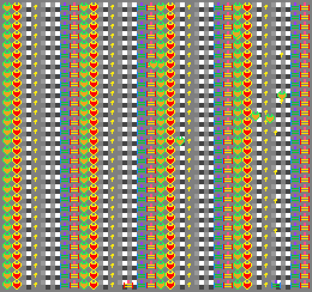

# Let's rock and shoot!

Author: Lingxi Zhang

Design: It is a pseudo multiplayer game(on the same keyboard) that two people can play competitively with each other by operating a tank.

Screen Shot:

How Your Asset Pipeline Works:

I draw 8x8 png pixel art in gimp and write mapconverter.cpp to convert it to tile and palette and put them under asset folder, later I load it in the beginning of game mode using write and read chunk.

How To Play:

1st player: wasd for direction, space for shooting.

2nd player: the arrow keys for direction, enter for shooting.

shoot as more balloons as possible to earn scores!

This game was built with [NEST](NEST.md).

